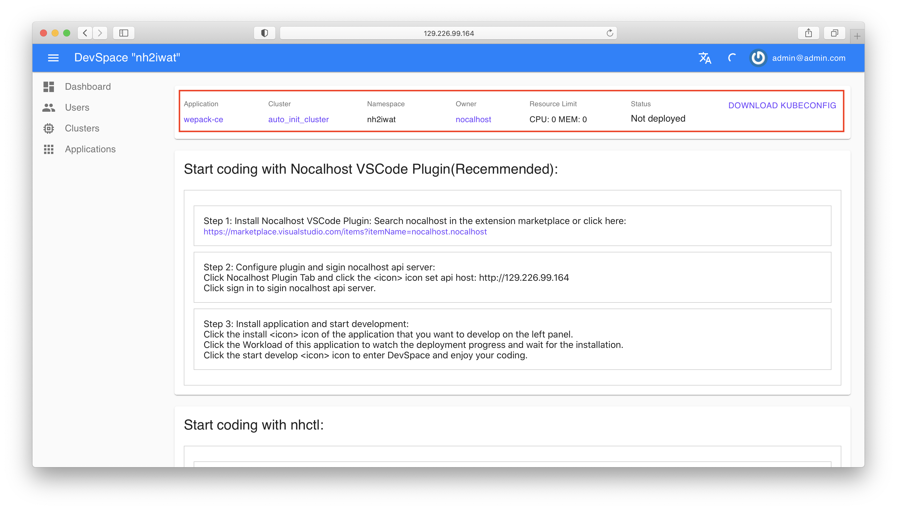
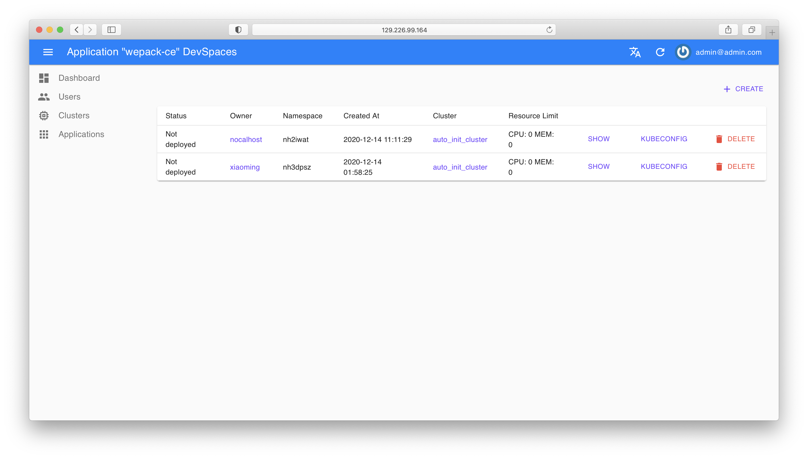
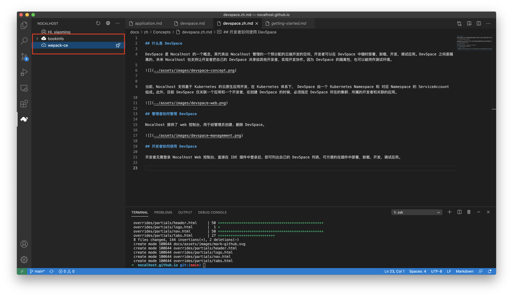

## What is DevSpace

`DevSpace` is a concept of `Nocalhost`, which represents a pre-allocated cloud development space managed by `Nocalhost`. Developers can install, uninstall, develop, and debug applications in DevSpace at any time. DevSpaces are isolated.

In future, `Nocalhost` will also allow developers to share their DevSpaces with other developers for development collaboration. Because of the isolation of DevSpace, it can also be used as a test environment.

{:target="_blank"}

Currently, Nocalhost supports cloud native application development based on Kubernetes. Under the Kubernetes system, DevSpace consists of a Kubernetes `Namespace` and a `ServiceAccount` corresponding to the Namespace. 

In addition, currently DevSpace is only associated with one application and one developer. When creating a DevSpace, you must specify the cluster where the DevSpace is located, the developer to which it belongs, and the associated application.

{:target="_blank"}

## How managers manage DevSpace

Nocalhost provides a web console for administrators to create and delete DevSpaces.

{:target="_blank"}

## How developers use DevSpace

Developers do not need to log in to the `Nocalhost Web`. After logging in directly in the IDE plug-in, user can get their DevSpace list, which can be easily deployed, uninstalled, developed, and debugged in the plug-in.

{:target="_blank"}