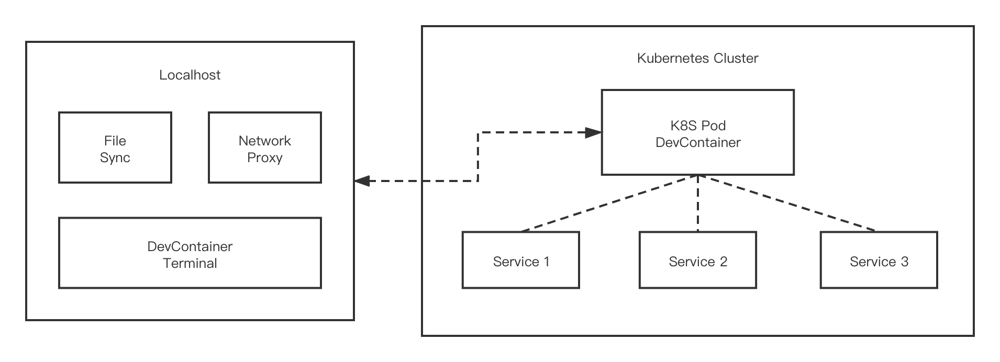

# Nocalhsot vs. Other Software

It is difficult to compare the differences between different software, especially when asked whether it can be replaced by other software? And can different software be related to each other?

In this chapter, we compare Nocalhost with other software.

It is recommended to read[“Nocalhost-Redefining the Development Environment”](/Blog/redefine-cloud-native-dev-environment/) first, which helps to understand the problem that Nocalhost is trying to solve.

In summary, there are currently three ideas for accelerating development in the Kubernetes environment:

1. Monitor local code changes, execute the CI/CD pipeline locally immediately after the modification, rebuild the microservice image and automatically deploy it to the Kubernetes cluster. This is the practice of `Google Cloud Code`, `Skaffold`, and `Tilt`:

    

2. Replace the workload to be developed with the `Proxy` network proxy container, forwarding the traffic in the cluster to the local, and forwarding the local traffic to the cluster. Use `docker run` locally to run the microservice container. This is how `Telepresence` does:

    

3. Replace the workload to be developed with a development container, map local code to a remote directory, build and run microservices in the remote container. This is how `Nocalhost` does:
    

In addition, `Nocalhost` also provides application management, development environment management, VS Code plug-in, IDEA plug-in, etc. which are conducive to standardization and accelerate development.

You can click the menu on the left to browse the comparison between Nocalhost and specific software.

> These comparisons are not to convince you to use Nocalhost, nor are they intended to belittle other software. Our goal is only to better understand the functional differences between Nocalhost and other software. If you think any stated facts are incorrect, please submit a PR for improvement.