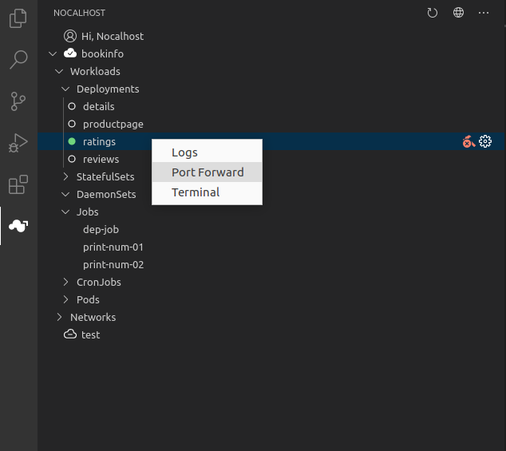

`Port Forward` is an important feature of `nocalhost` 's `Dev-Mode` and it‘s supported only while enable `Dev-Mode`.  `port-forward` allows you to access and interact with internal Kubernetes cluster processes from your localhost.


Use `nhctl` to forward port:

```
Usage:
  nhctl port-forward [NAME] [flags]

Flags:
  -m, --daemon              if port-forward run as daemon (default true)
  -d, --deployment string   k8s deployment which you want to forward to
  -p, --dev-port strings    port-forward between pod and local, such 8080:8080 or :8080(random localPort)
```


To forward application bookinfo's port 8080 to local random port:

```
nhctl port-forward bookinfo :8080
```


And you can also use `Port Forward` by using **IDE Plugin**:

