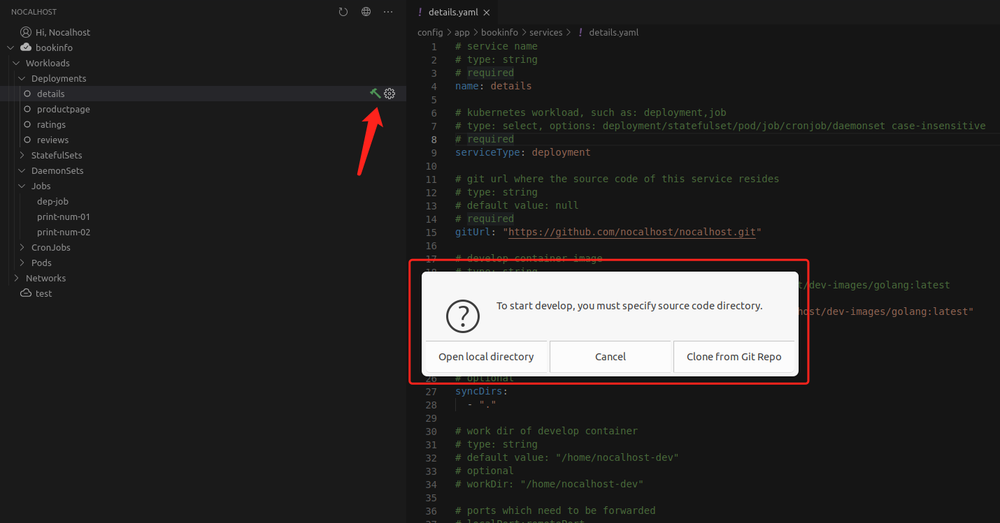

# SyncFilePattern/IgnoreFilePattern


## Description

If some files should be or not be synchronized to (or from) other devices, configure the corresponding `SyncFilePattern`/`IgnoreFilePattern`. All patterns are relative to the folder root (The folder you select while get into `DevMode`).

[  ](../assets/images/concept/enter-dev-mode.png){:target="_blank"}

**Caution: The priority of the `IgnoreFilePattern` is higher than `SyncFilePattern`, so if your pattern both covered the same file, the file will be ignored.**


## Patterns syntax


- Regular file names match themselves, i.e. the pattern `foo` matches the files `foo`, `subdir/foo` as well as any directory named `foo`. Spaces are treated as regular characters, except for leading and trailing spaces, which are automatically trimmed.

- **Asterisk** (`*`) matches zero or more characters in a filename, but does not match the directory separator. `te*ne` matches `telephone`, `subdir/telephone` but not `tele/phone`.

- **Double asterisk** (`**`) matches as above, but also directory separators. `te**ne` matches `telephone`, `subdir/telephone` and `tele/sub/dir/phone`.

- **Question mark** (`?`) matches a single character that is not the directory separator. `te??st` matches `tebest` but not `teb/st` or `test`.

- **Square brackets** (`[]`) denote a character range: `[a-z]` matches any lower case character.

- **Curly brackets** (`{}`) denote a set of comma separated alternatives: `{banana,pineapple}` matches either `banana` or `pineapple`.

- **Backslash** (`\`) “escapes” a special character so that it loses its special meaning. For example, `\{banana\}` matches `{banana}` exactly and does not denote a set of alternatives as above. *Escaped characters are not supported on Windows.*

- A pattern beginning with `/` or `./` matches in the root of the folder only. `/foo` or `./foo` matches `foo` but not `subdir/foo`.

- A pattern beginning with a `(?i)` prefix enables case-insensitive pattern matching. `(?i)test` matches `test`, `TEST` and `tEsT`. The `(?i)` prefix can be combined with other patterns, for example the pattern `(?i)picture*.png` indicates that `Picture1.PNG` should be synchronized. On Mac OS and Windows, patterns are always case-insensitive.

  

> Note
>
> Prefixes can be specified in any order (e.g. “(?i){foo,bar}/\*/bar”), but cannot be in a single pair of parentheses (not "{foo,(?i),bar}/*/bar").


## Example

Given a directory layout:

```
.DS_Store
foo
foofoo
bar/
    baz
    quux
    quuz
bar2/
    baz
    frobble
My Pictures/
    Img15.PNG
nocalhost/
    hello
    test/
    team/
```

and with following config:

```
SyncFilePattern:
  - frobble
  - quuz
  - ./nocalhost
  
IgnoreFilePattern:
  - foo
  - *2
  - qu*
  - (?i)my pictures
  - nocalhost/t**
```

The priority of the `IgnoreFilePattern` is higher than `SyncFilePattern` and the end result becomes:

```
foo           # ignored, matches IgnoreFilePattern "foo"
foofoo        # synced, does not match IgnoreFilePattern "foo", but would match "foo*" or "*foo" 
bar/          # synced, no such config, so synced
    baz       # synced, no such config, so synced
    quux      # ignored, matches IgnoreFilePattern "qu*"
    quuz      # ignored, though specify the SyncFilePattern "quuz",but matches higher level IgnoreFilePattern "qu*"
bar2/         # ignored, matches IgnoreFilePattern "*2"
    baz       # ignored, due to dir parent being ignored
    frobble   # ignored, due to dir parent being ignored
My Pictures/  # ignored, matched IgnoreFilePattern case insensitive "(?i)my pictures" pattern
    Img15.PNG # ignored, due to parent being ignored
nocalhost/    # synced, no such config, so synced
    hello     # synced, no such config, so synced
    test/     # ignored, matches IgnoreFilePattern "nocalhost/t**"
    team/     # ignored, matches IgnoreFilePattern "nocalhost/t**"
```