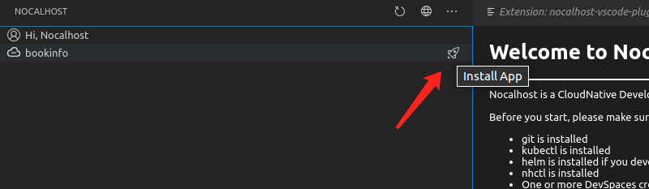
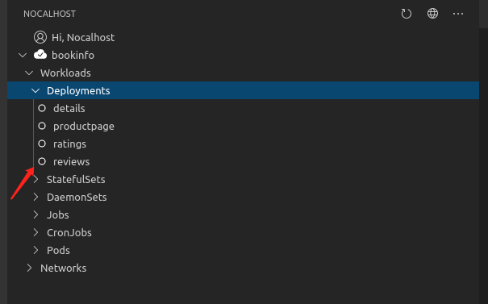
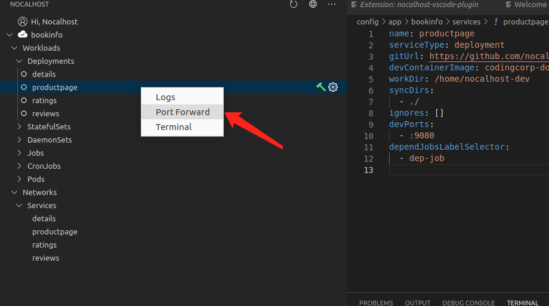
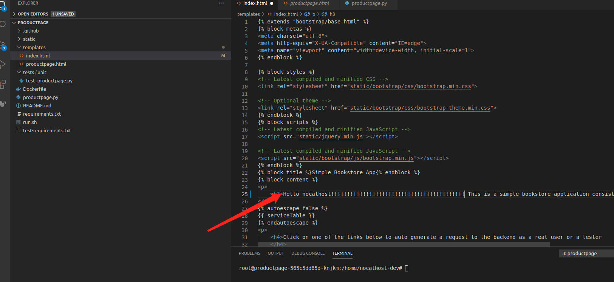
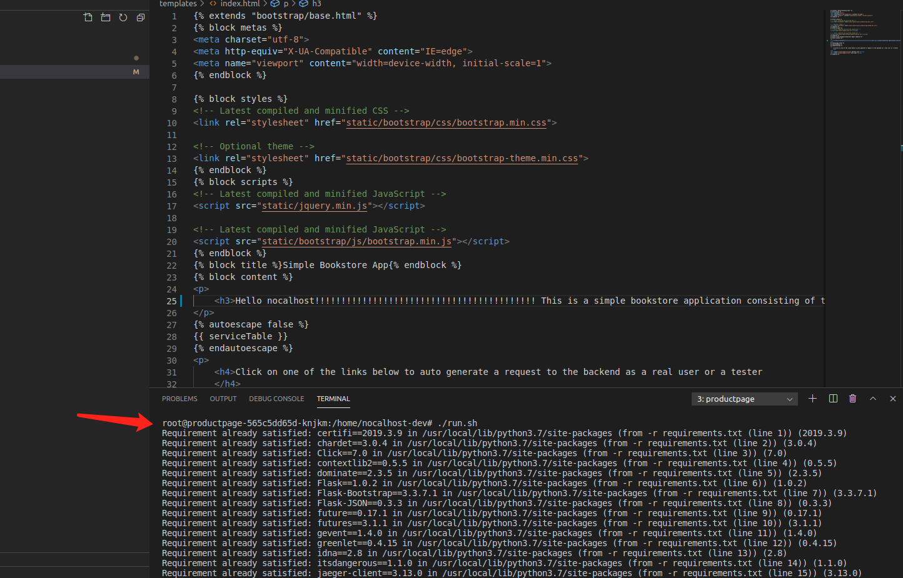
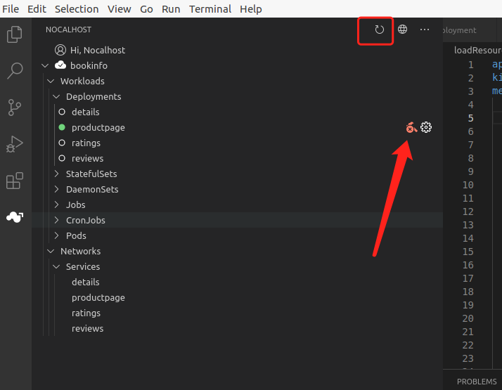
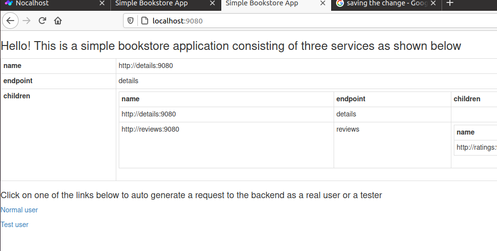
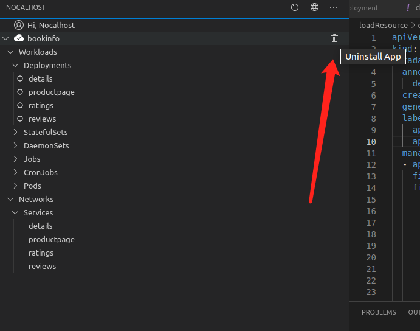

This tutorial shows best practices to use `Nocalhost` by using Quick-Experience kubernetes application ['bookinfo'](https://github.com/nocalhost/bookinfo).

## Prerequisites

Make sure you have been deploy `Nocalhost` and can access `Nocalhost-server` correctly.

**Here are some tutorials for deploying `Nocalhost` and getting `Nocalhost-server-url` by using different technologie:**

- [Minikube](/Deployment/deployment-minikube/)
- [Kubernetes Cluster](/Deployment/deployment-kubernetes/)
- [TKE](/Deployment/deployment-tke/)

### STEP 1: Configure and login Nocalhost Server in VSCode

First make sure your plugin has been installed

Switch to the `Nocalhost` tab

Specify your `nocalhost-web` endpoint, and type in the address to access `Nocalhost-Server` current used.

> Do not know the site of nocalhost-server url? 
>
> Back to the top of this doc and choose your kubernetes cluster type's deployment tutorial.

Sign in with email `foo@nocalhost.dev` and pwd `123456` 

> Why not login with `admin@admin.com`? 

> You can enter the `Nocalhost` homepage, switch to the tab `Application`, and there is a `Application` sample named 'bookinfo'.

> click `SPACE LIST`, then you can see `Nocalhost` created a `DevSpace` for User `Nocalhost`. That can be simply understood as `DevSpace` under `Application` is the workspace user can access in the `VSCode Nocalhost Plug-in`.

### Step 2: Install demo application: bookinfo

Here show all the `DevSpace` hold by the user you sign in. Each spaces can be installed according to your configuration in `Nocalhost-Web`.

> Don't see any DevSpace after sign in? see [how to config nocalhost-web](/Tutorials/nocalhost-web-configuration)

Now click the rocket to install it:

Waiting for Application startup. 

The cycle icon means the resources is already running.

Wait until all pods start up, now forward the port of `Deployment` 'productpage' by right clicking it and select `Port Forward` to access this application on site.

Type in 9080:9080 and press `Enter`.

Then we can access 'bookinfo' on site http://localhost:9080.

### Step 3: Start dev mode

Start develop and entering `Dev-Mode` by clicking one of `Deployment`'s hammer, 'productpage' for example.

You can specify your source code dir both local directory or git repo, here we use git repo, and 'productpage''s source code is on  `https://github.com/nocalhost/bookinfo-productpage`, then choose a local directory to clone source code.

Waiting for the dev mode complete startup, `Nocalhost-Plug-In` will open a new window according to the local directory you specified with cloned source code.

> If the source code is already on your machine, you can choose `Open local directory` directly while enter develop by clicking hammer

`Nocalhost` will replace the deployment's container you develop, those files in the directory you specified such as the source code will be synchronized real-time into the container.

### Step 4: Change the code and check the result

Let's modify the `templates/index.html` or something else. **Don't forget to saving the change because nocalhost do not synchronize your change in memory!**

Then run `./run.sh` in the terminal, wait for the app up.

> This step can be any command to start your application, such as:
>
> java Main
>
> gradle build && java -jar ./foo/bar.jar
>
> python helloworld.py

Access bookinfo on site http://localhost:9080 again, our changes is take effect:

`Nocalhost` helps to have a coding experience that almost like develop in the container, so you needn't wait for build images, CI/CD, etc... Just modify your code, and run it.

### Step 5: End develop and uninstall `Application`

Now return to the `VSCode`, click the red hammer to end dev mode (may click the `Reresh` icon to synchronize the latest status).

While dev mode end, current container replaced before will be restored. Let's access 'bookinfo' on site http://localhost:9080:

Click the bin to uninstall `Application` that all k8s resources in this `Application` will be removed.

## Congratulations!

You have had a great experience about the Cloud Native development through above Nocalhost simple tutorial. You can start to try to configure and use the Nocalhost in the real project now.

Any feedback is welcomed. Github Issues: https://github.com/nocalhost/nocalhost