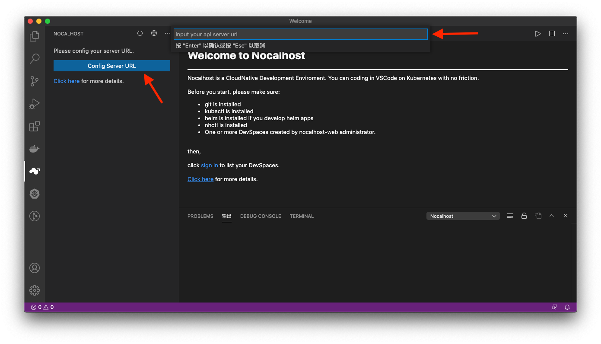
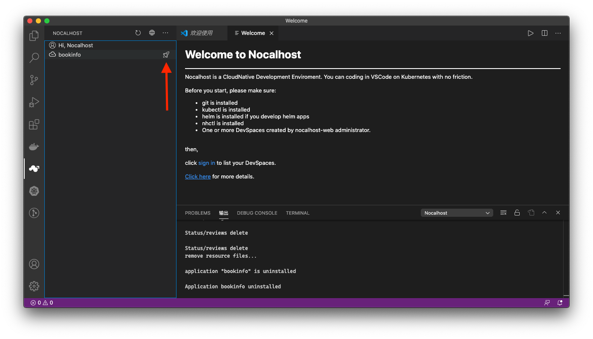
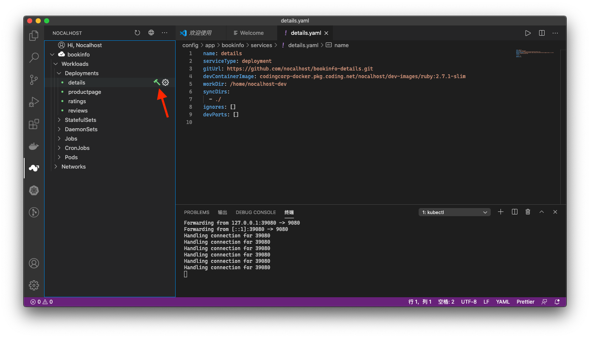

# Start coding with Nocalhost VSCode Plugin (Recemmended)

1. Install Nocalhost VSCode Plugin, [here](/installation/#install-nocalhost-vscode-plugin).

2. Configure plugin and sigin nocalhost api server.
{:target="_blank"}
{:target="_blank"}

3. Install application and start development.  
Click the install icon of the application that you want to develop on the left panel.  
{:target="_blank"}
Click the Workload of this application to watch the deployment progress and wait for the installation.  
Click the start develop icon to enter DevSpace and enjoy your coding.  
{:target="_blank"}