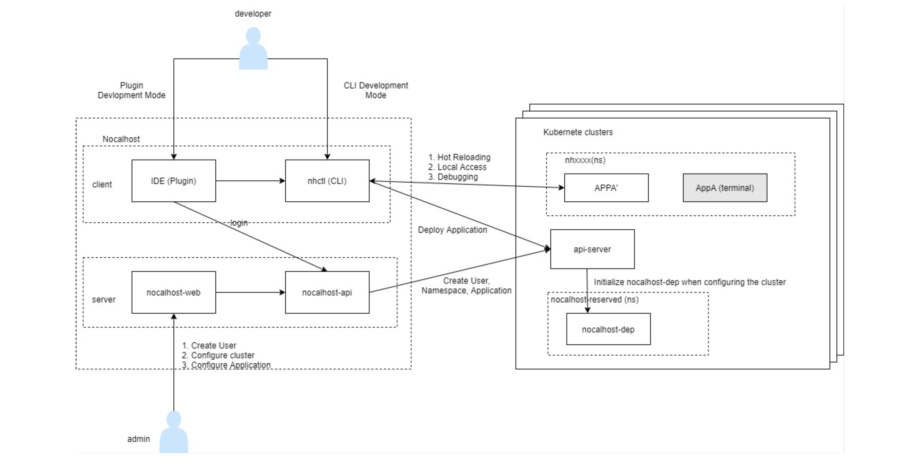

### What is Nocalhost?
Nocalhost with client and server-side component  is a open-source developer tool for Kubernetes:

* **Deploy applications just one click, even with complex service dependencies**
* **Build, test and debug applications directly inside Kubernetes**
* **Develop with hot reloading**: updates your running containers without rebuilding images or restarting containers

### How does it work?
* Deploy Nocalhost Server (nocalhost-api, nocalhost-web) to the kubernetes cluster.

* Use the management platform provided by Nocalhost Server to create users, configure the application's kubernetes cluster, create applications, and configure the application's namespace. When configuring the kubernetes cluster, nocalhost-dep will be automatically deployed in the nocalhost-reservered namespace.

* Install the nhctl CLI on the client machine and install the Nocalhost plug-in in the IDE. Configure the nocalhost-api server url (for example: http://ip:port) in the plug-in and login, then deploy application to the kubernetes cluster.

* develop a specified service, first stop the pod of the service, then redeploy a pod, and open up the local and kubernetes network, it will automatically monitor local file changes and synchronize to the container of the new pod in real time and complete the compilation and deployment

* Debug a specified service, At the beginning of development, nhctl has automatically done port forwarding, and obtained the port forwarded to the local, and the IDE can be debugged after configuring remote debug.

Here's the diagram of Nocalhost with all the components tied together.

### Component
**IDE plugin**
* IDE plugin packs the capabilities of nhctl and nocalhost-api development environment management to provide users with a better experience.
**nhctl**

nhctl is the core component of nocalhost, the core functions are as follows:

* **Install Application**
Nocalhost will deploy applications to kubernetes cluster according to the dependencies of the application which is defined in config YAML under the .nocalhost directory.

* **Hot Reloading Via File Sync**
Any changes made to the local service will be automatically synchronized to the new container of the kubernetes cluster through syncthing

* **Debugging Via Remote Debugger**
* When the development mode is turned on, nhctl will open up the local and kubernetes cluster network, establish a link between the local and the new pod, and map the port to the local through port forward. At this time, you can directly perform remote debugg in the IDE.

* **uninstall application**
Release and recycling of kubernetes cluster resources

**nocalhost-web**
* nocalhost-web provides a visual interface to manage users, development kubernetes clusters, applications and development namespaces

**nocalhost-api**
* Nocalhost manages serviceAccount, namespace and application in kubernetes cluster through api-server, and persists to mysql, providing data support for plug-in usage.

**nocalhost-dep** 
* When application microservices are deployed in a Kubernetes cluster using Manifest, the startup sequence and dependencies of these microservices cannot be controlled. A typical scenario is: Service A and Service B both rely on Mysql, Redis, RabbitMQ, and only when these dependent services are available can Service A and Service B be started. To solve this problem, usually when the dependent services are running, manually delete the pods of service A and service B, and restart the solution. In addition to basic services that all services rely on like Mysql, there may also be dependencies between services and services. If there are a large number of microservices, sorting out the manual restart sequence will become very complicated and time-consuming.
* nocalhost-dep implements Kubernetes Admission Webhook using the same technology selection as Istio injecting Sidecar. When a new application is deployed to the cluster, nocalhost-dep will automatically inject the InitContainer Sidecar into the workload according to the declared dependencies, and query and wait for the dependent services in the InitContainer until the startup is completed, using the features of InitContainer to start the real business container , Realize service dependency processing. The principle of InitContainer is to use k8s-wait-for to achieve.