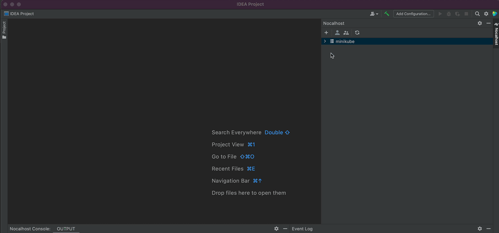
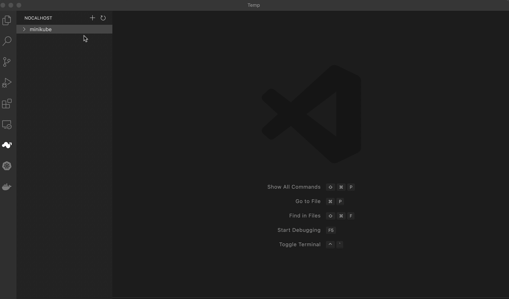

## Connect


Nocalhost supports multi cluster management, you can add any Kubernetes in IDE plugin by select kubeconfig file or pastes the kubeconfig file as text to add cluster.

**1. Select kubeconfig file**

Select a kubeconfig file from your local directory.

!!!tip "Default Path"
    Nocalhost will try to load kubeconfig from your local `~/.kube/config` by default. You can also change the default path.

**2. Paste kubeconfig as text**

Paste kubeconfig as text. Once kubeconfig has successfully read, select the right context, then connect to cluster.

!!!tip "Get Kubeconfig"
    You can view kubeconfig by running the following command in the system where the Kubernetes cluster is installed, and then copy and paste it.

    ```bash
    kubectl config view --minify --raw --flatten
    ```

=== "VSCode Plugin"

    1. Click  icon connect to cluster
    2. Click **Add Kubeconfig** and select the suitable method to connect

    <center>
        
    </center>

=== "JetBrains Plugin"

    1. Click  icon connect to cluster

    2. Select the suitable method to connect

    <center className="img-margin">
        
    </center>

## Remove Cluster

=== "VSCode Plugin"

    Right-click the specified cluster, and then click **Remove** to remove the specified cluster from the cluster list.

    <center className="img-margin">
        
    </center>

=== "JetBrains Plugin"

    Right-click the specified cluster, and then click **Remove** to remove the specified cluster from the cluster list.

    <center className="img-margin">
        
    </center>

## View Cluster's Kubeconfig

Right-click the specified cluster and select **View Kubeconfig**, the Nocalhost plugin will open the kubeconfig of the cluster.

=== "VSCode Plugin"

    <center className="img-margin">
        
    </center>

=== "JetBrains Plugin"

    <center className="img-margin">
        
    </center>
