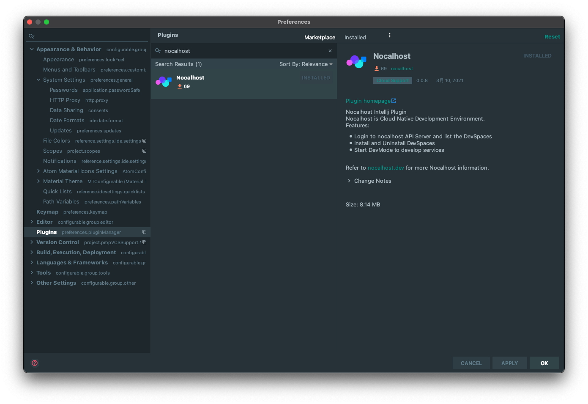
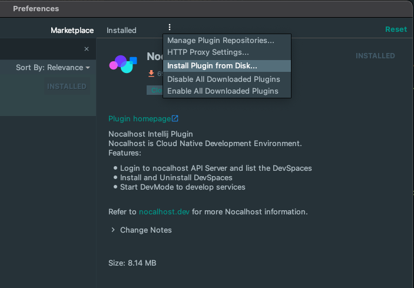

## Install Nocalhost VScode Plugin

The Nocalhost VScode Plugin allows you to use Nocalhost on VSCode Editor.
You can install application, open DevSpace, start DevMode in VSCode conveniently.

### Install Nocalhost VScode Plugin on VScode Marketplace
Follow this link: [https://marketplace.visualstudio.com/items?itemName=nocalhost.nocalhost](https://marketplace.visualstudio.com/items?itemName=nocalhost.nocalhost){:target="_blank"}

### Or Install Nocalhost VScode Plugin on VScode Editor
1. Open the VScode Editor, and click left bar "Extensions" icon.
2. Type "nocalhost" in the search input box.
3. Select the "nocalhost-vscode-plugin", and the click install button to install.

{:target="_blank"}

## Install Nocalhost IntelliJ Plugin
Follow this link: [https://plugins.jetbrains.com/plugin/16058-nocalhost](https://plugins.jetbrains.com/plugin/16058-nocalhost){:target="_blank"}.

- Using Jetbrains IDE built-in plugin system on Windows:
    - <kbd>File</kbd> > <kbd>Settings</kbd> > <kbd>Plugins</kbd> > <kbd>Browse repositories...</kbd> > <kbd>Search for "nocalhost"</kbd> > <kbd>Install Plugin</kbd>

- Using Jetbrains IDE built-in plugin system on MacOs:
    - <kbd>Preferences</kbd> > <kbd>Settings</kbd> > <kbd>Plugins</kbd> > <kbd>Browse repositories...</kbd> > <kbd>Search for "nocalhost"</kbd> > <kbd>Install Plugin</kbd>

{:target="_blank"}

- Manually:
    - Download the [latest release](https://github.com/nocalhost/nocalhost-intellij-plugin/releases/latest){:target="_blank"} and install it manually using <kbd>Preferences</kbd> > <kbd>Plugins</kbd> > <kbd>Install plugin from disk...</kbd>

{:target="_blank"}

!!! note "Prerequisites"
	To use nocalhost, please make sure that  [git](https://git-scm.com/downloads){:target="_blank"}, [kubectl](https://kubernetes.io/docs/home/){:target="_blank"} and [helm](https://helm.sh/){:target="_blank"} are installed.

