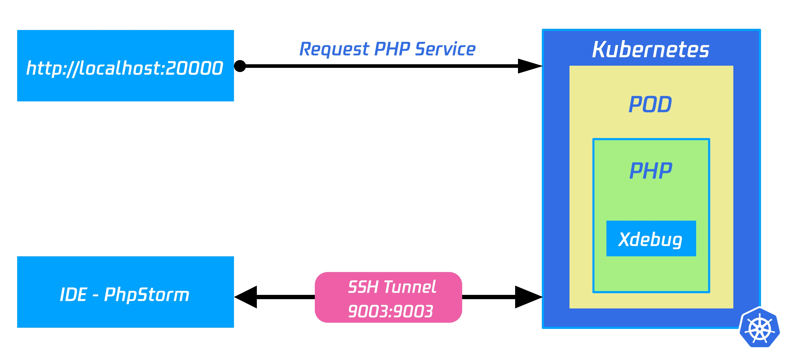

# Remote Debugging of Python Application

!!!note About this guide
    **Gold :**  Use Nocalhost to debugging PHP application <br />
    **Estimate time :** 3 minutes<br />
    **Requirements :** PyCharm and Nocalhost IDE plugin installed
  
## 1. Config Remote Debug Command and Port

1. Open PyCharm and Nocalhost plugin
2. Select the workload you want to debug, right click and select `Config`
3. Configure the remote debug command and port

```yaml hl_lines="5-8"
service:
  containers:
    dev:
    command:
      debug:
       - ./debug.sh
    debug:
      remoteDebugPort: 9004
...
```
## 2. Enter Development Mode

Start the development mode


## 3. Add Configuration

Add Nocalhost debug configuration, enter the same port number with your `remoteDebugPort` above.


## 4. Set Break Point and Debug

Set the break point and start debugging 


## How it Works?

Nocalhost using pydevd to debug Python application.



