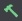
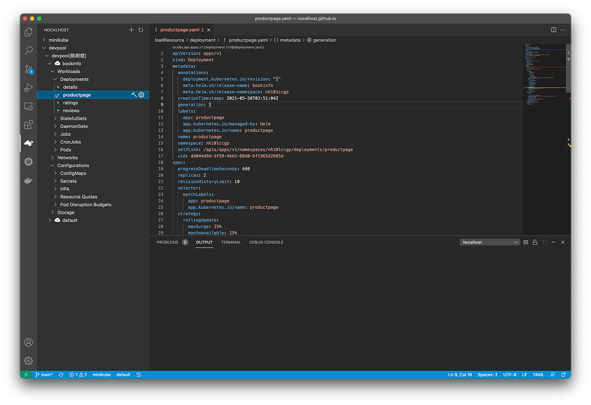
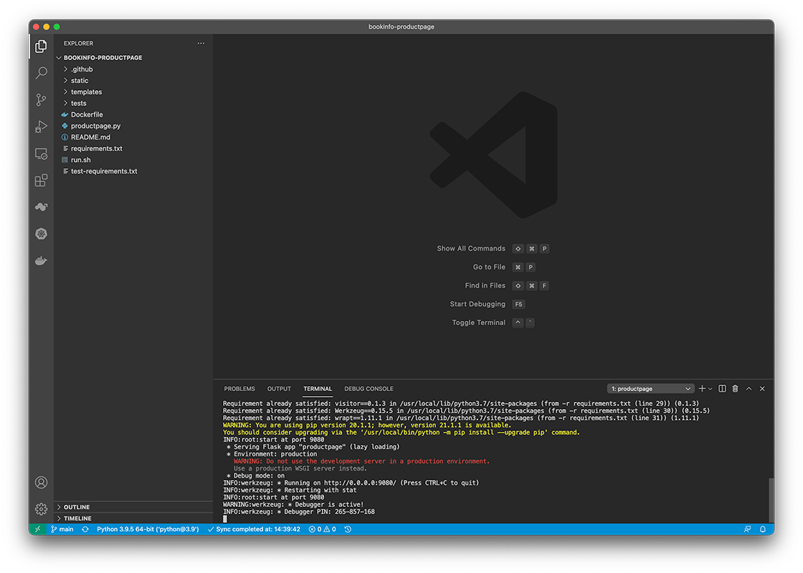
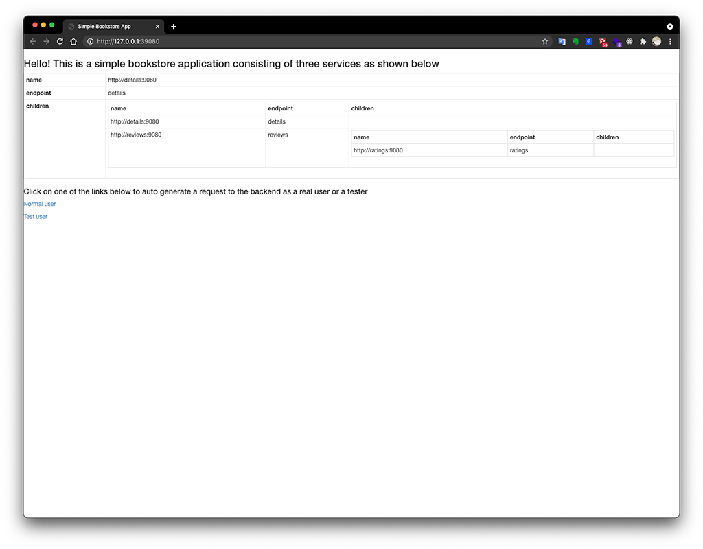
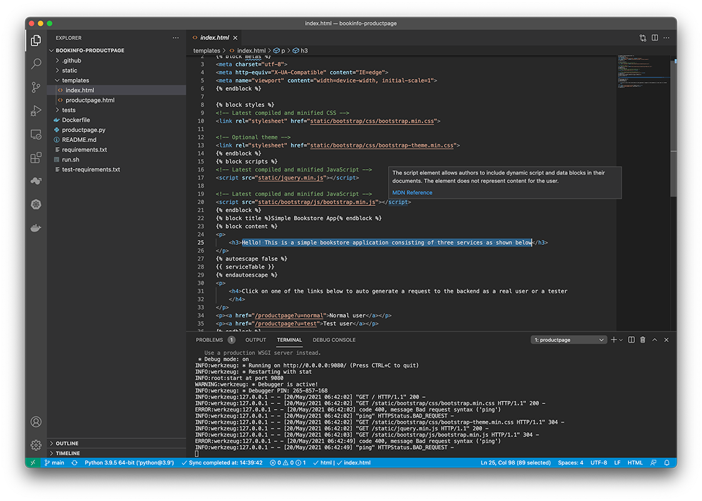

Welcome to Nocalhost! In this guide, we'll walk you through how to install Nocalhost, and use Nocalhost to experience the convenient Cloud Native applications development on Kubernetes.

## Prerequisites

* **Configured Kubernetes Cluster (with 2 Core and 4G Memory)** which can either be a cluster for local development, such as [minikube](https://minikube.sigs.k8s.io/docs/start/) or [Docker Kubernetes](https://docs.docker.com/docker-for-mac/kubernetes/) cluster, or a remote cluster, such as [Tencent TKE](https://cloud.tencent.com/product/tke). 
* **RBAC** must be enabled in above cluster
* **Configured [kubeconfig](https://kubernetes.io/docs/tasks/access-application-cluster/configure-access-multiple-clusters/) file** that has namespace admin privilege
* **[kubectl (1.6+)](https://kubernetes.io/docs/home/)** installed
* Visual Studio Code (1.52+)
* Kubernetes api-server can be accessed internal and external

## Step 1: Install

Make sure you have finished the Nocalhost VSCode plugin following [Client Installation](https://nocalhost.dev/installation)

## Step 2: Configure and use Nocalhost extension in VSCode

### Open Extension

Open the VSCode, click on the Nocalhost icon  on the sidebar, open the Nocalhost plugin


### Add Kubernetes cluster

You can add a Kubernetes cluster by two methods:

**- Select kubeconfig file** to select the kubeconfig file from your local path.

!!!note 
    Nocalhost will try to load kubeconfig from your local ``~/.kube/config`` by default.

**- Paste as text** to paste the kubeconfig plain text.

!!!tip
    You can check your kubeconfig by using ```kubectl config view --minify --raw --flatten```

After the kubeconfig file successfully loaded, select the context that you want to access, then add the cluster.

**Nocalhost** will automatically show the cluster list once you successfully add cluster:


!!!tip Example Application
    We will using the bookinfo application as an example here. You can use your own application that already deployed in your Kubernetes clusters, or you can follow **[Deploy Example Application in K8s](../References/deploy-book-info-app-manifest)** to deploy bookinfo app in your Kubernetes clusters.

## Step 3: Start DevMode

Select the application that you want to develop, we are using the **bookinfo** app as example. 

Select the **productpage** service, click  to start the **DevMode**, specify the source code directory (clone from Git repo or use existing local directory)



!!!note Change the remote Git repo after set
    If you want to change the Git repo after url has set, you can click  to modify the ``gitUrl`` option in the yaml file

After specify the source code directory (or successfully clone the code), Nocalhost will open a new VSCode window, then will automatically start the DevMode.


When DevMode completed, you should see the following message:

```
Starting DevMode...

...

Waiting pod to start...
Forwarding 39080:9080
Response: {"errInfo":""}
Port-forward 39080:9080 has been started

 ✓  Dev container has been updated

...
```

!!!tip Port Forwarding
    Nocalhost will automatically run port-forward to a pod in a Kubernetes cluster. In this case, local port **39080** forwards data to port **9080** on the defined pod. You can access this pod via ```http://127.0.0.1:39080``` after the main process started

## Step 4: Change the code and check the result

Let's make some code change and see how Nocalhost works

#### Execute sh command to start the python process

```
sh run.sh
```



!!!note "Main process within container"
    In DevMode, the application main process will not automatically start by default in the DevContainer, thus the application will not response any request. You need to manually start the main process before you can access.

Open your web browser and check the result on [http://127.0.0.1:39080](http://127.0.0.1:39080)




#### Change the code

Let's modify ``template/index.html`` or something else. **Don't forget to Save your change.**



Refresh the web browser and check the latest outcome [http://127.0.0.1:39080](http://127.0.0.1:39080)


👍 **Congratulations!** You are all set to go

## What's Next

Here are some recommended next steps:

* Learn Nocalhost starting from its [Core Concepts](https://nocalhost.dev/Concepts/cluster/)
* Join our [Slack](https://nocalhost.slack.com/) and/or [WebChat Group](./)

