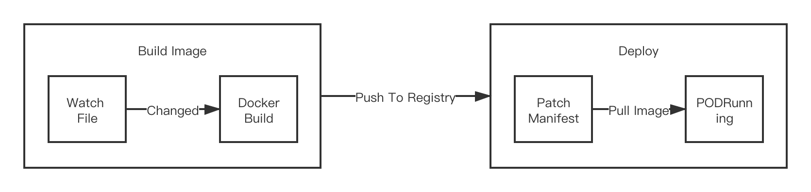
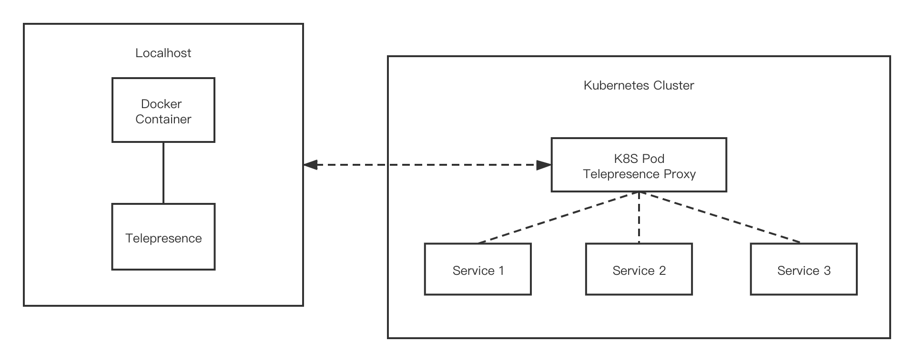

# Nocalhsot vs. Other Software

要对比不同软件之间的差别是困难的，尤其是当问到是否可以用其他软件来替代？以及不同的软件之间可以相互协同吗？

在本章节中，我们将 Nocalhost 与其他的软件进行比较.

建议先阅读[“Nocalhost - 重新定义云原生开发环境”](/zh/Blog/redefine-cloud-native-dev-environment/)，他们有助于理解 Nocalhost 试图解决的问题。

总结来说，要加速在 Kubernetes 环境下的开发目前有三种思路：

1. 监听本地代码变更，发生修改后立即在本地执行 CI/CD 流水线，重新构建微服务镜像并且自动部署到 Kubernetes 集群。这是 `Google Cloud Code`、`Skaffold`、`Tilt` 的做法。

    

2. 将要开发的工作负载替换为 `Proxy` 网络代理容器，转发集群内的流量到本地，以及转发本地的流量到集群。本地使用 `docker run` 运行微服务容器。这是 `Telepresence` 的做法。

    

3. 将要开发的工作负载替换为开发容器，并将本地代码和远端目录映射，构建和运行微服务都在远端容器内。这是 `Nocalhost` 的做法。
    

此外，`Nocalhost` 还提供了应用管理、开发环境管理、VS Code 插件、IDEA 插件等有利于标准化以及加速开发的能力。

您可以点击左侧的菜单浏览 Nocalhost 与特定软件的对比。

> 这些比较并不是说服您使用 Nocalhost，也不是有意贬低其他的软件。我们的目标只是为了更好地了解 Nocalhost 与其他软件在功能上的差异，如果您认为任何陈述的事实不正确，欢迎提交 PR 改进。

## Telepresence

Telepresence 通过在集群中部署网络代理的 Pod，该 Pod 会将 Kubernetes 环境的数据（例如：TCP 连接、环境变量、卷）代理到本地进程。本地进程通过代理的方式连接到远端 Kubernetes 集群，以便直接通过 DNS 方式访问远端微服务。

Telepresence 的理念非常好，但具有以下缺点：

* 在某些受控的网络环境下可能无法与远端集群建立 VPN 连接。
* 本地使用 Docker Run 的方式运行服务，可能和 Pod 的运行方式存在一定差异，例如无法模拟 `InitContainer`
* 使用 `sshfs` 来挂载远端的卷，无法支持没有 WSL 的 Windows。
* 开发、调试流程不连续，需要在不同阶段人工执行数条命令。

## Tilt, Skaffold, Google Cloud Code

Tilt, Skaffold, Google Cloud Code 都可以自动执行从本地代码更改到更新过程的所有步骤：监视本地文件，重新构建容器映像并更新环境，就像是自动化的 `docker build && docker push && kubectl apply` 或 `docker-compose up`，可以理解为是本地的 CI/CD 工具。

他们都无法避免每次更新代码都需要重新构建镜像并更新工作负载的过程。Tilt推出了一种不需要每次重新构建镜像的方法[“live_update”](https://docs.tilt.dev/live_update_tutorial.html)，配置起来比较复杂，并且也只是缩短了 `docker build` 的时间。

Skaffold 具有 `beta` 版的文件同步功能，可以将本地的改动打包成 tar 并同步到容器中，无需重新构建镜像、重新部署和重启 POD，但目前仍然有一些使用限制。

Google Cloud Code 除了能够自动进行 CI/CD 流程以外，还提供了便于开发的 VS Code 和 IDEA 插件，但其与 Google 的云服务有较强的绑定。