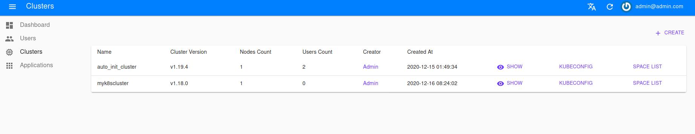

## 什么是 Cluster

`Cluster` 是 `Nocalhost` 的一个概念，它通常对应着一个 k8s 集群，它需要维持一份拥有这个集群 `Cluster-Admin` 权限的 `kubeConfig`。

`Nocalhost` 支持同时管理多个 `Cluster`，这些集群可以是 `GKE`、 `minikube`、`microK8s` 等等。

[  ](../../assets/images/concept/cluster.png){:target="_blank"}

## Cluster 是做什么的

`Cluster` 管理运行开发环境中的应用程序的资源。

`Cluster` 一般与 `DevSpace` 配合使用，我们需要在 `Nocalhost-Web` 进行 `Cluster` 的配置。在实际的开发过程中，用户不需要直接接触 `Cluster` 这个概念，而用户在 `DevSpace` 下的操作实际上都借助了 `Cluster` 的能力。

## 如何管理 Cluster

首先进入 `Nocalhost-Web` ，切换到 `Clusters` 这一栏，这里会展示所有的 `Cluster` 列表。

[  ](../../assets/images/concept/cluster-list.png){:target="_blank"}

点击右上角的 `CREATE` 进行 `Cluster` 的创建。这里要注意，确认此 `kubeconfig` 是否拥有集群管理权限，可使用如下命令进行确认：

```
> kubectl auth can-i '*' '*'
yes
```


