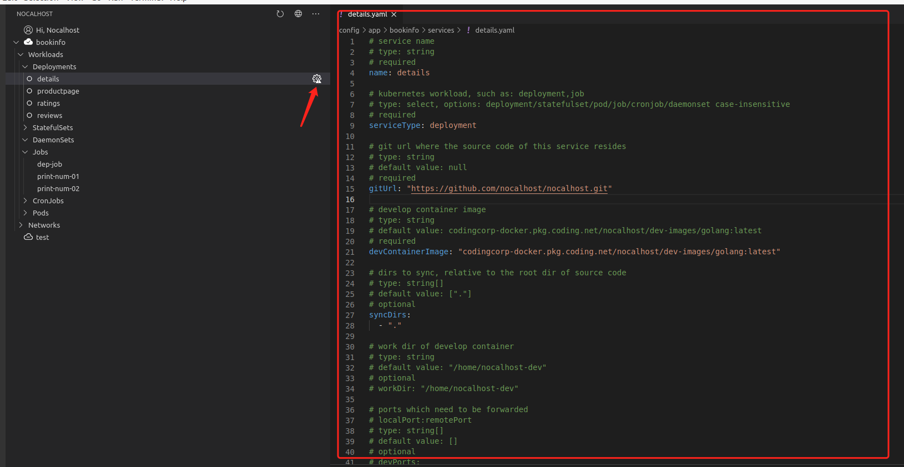
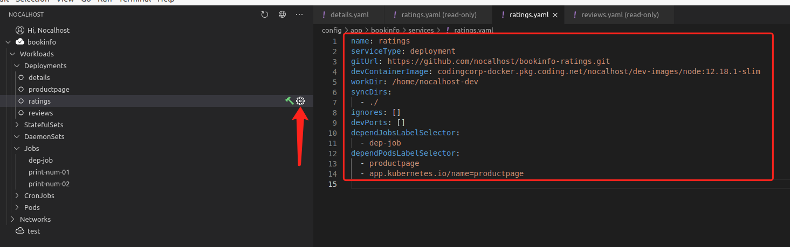

## 什么是 Service

`Service` 与 `kubernetes` 的 `svc` 完全不同，`Service` 可以认为是对 `Deployment` 的增强，对应我们应用中的一个具体服务，`Service` 目前支持两种功能：


- 对 `Nocalhost` `Dev-Mode` 的配置，例如进入开发容器后的工作空间是哪个，将哪些文件同步到开发容器中，等。

- 支持基于依赖关系的 `deployment` 启动顺序控制


**这些配置并不是必须的！完全不进行配置，也可以照常创建 `Application`、`Cluster` 等等，也可以照常部署你的应用，`Service` 只在你有需要时才需要配置。**


例如，`Nocalhost` 支持控制一个资源的启动顺序，例如某个  `deployment` 必须依赖于某个`k8s job` 执行完毕，那么可以在 **config.yaml** 做如下配置：

```
services:
  - name: details
    type: deployment
    dependJobsLabelSelector:
    - "dep-job"
```


这表示你 `kind: Deployment` `name: Deployment` 的这个资源 [detail.yaml](https://github.com/nocalhost/bookinfo/blob/main/manifest/templates/detail.yaml){:target="_blank"}，将依赖于一个 `name: dep-job` 的任务 [dep-job.yaml](https://github.com/nocalhost/bookinfo/blob/main/manifest/templates/bookinfo/dep-job.yaml){:target="_blank"} 执行完毕。

```
apiVersion: apps/v1
kind: Deployment
metadata:
  name: details
```


## Service 提供的功能


### 1. 对开发模式的支持

前面说到 `Service` 承担两种角色，其一是对开发模式的支持，我们以如下这个配置为例，逐个说明：

```
services:
  - name: productpage
    serviceType: deployment
    gitUrl: https://github.com/nocalhost/bookinfo-productpage
    devContainerImage: codingcorp-docker.pkg.coding.net/nocalhost/dev-images/python:3.7.7-slim-productpage
    workDir: /home/nocalhost-dev
    syncDirs:
    - ./
    devPorts:
    - 39080:9080
```


#### `name` 与 `serviceType` 

当你想使用 `service` 时，`name` 与 `serviceType` 是必填项，用于定位到某个 manifest，目前只支持 `deployment` 这种 `serviceType`例如当前有一个 `Deployment` ，名字为 details：

```
kind: Deployment
metadata:
  name: details
```

想要对它进行配置，则需要在 **config.yaml** 内的 `services` 下进行如下配置：

```
  - name: productpage
    serviceType: deployment
```


#### devContainerImage

进入开发模式所使用的容器，启动 `DevMode` 时，实际上会使用开发容器来替换掉目标镜像。我们会为大多数开发语言提供默认的开发容器，这个容器里面通常包含一些常用的调试工具和常用库。


当然你也可以使用自己的镜像，如：

```
services:
  - name: productpage
    serviceType: deployment
    devContainerImage: foo/bar/python:dev
```


#### gitUrl 

用于标明与此 `Service` 对应的源码地址，在进入 `Dev-Mode` 时，你可以选择将本地某个目录同步到开发容器中，也可以选择从 `git` 仓库拉取，此时如果你已经配置了 `gitUrl`， 我们会自动帮你从这个 `gitUrl` 检出代码。


#### syncDirs

可选项，数组类型，选择将源码目录的哪些文件夹同步到开发容器中，默认为 `.` ，既所有。

```
services:
  - name: productpage
    serviceType: deployment
    syncDirs:
    		- foo/
    		- bar/
```


#### workDir

这是一个可选项，用于标明进入开发模式后的工作目录，以及同步文件所存放的目录，默认将使用 `/home/nocalhost-dev`


#### devPorts

自动转发的端口，在进入开发模式后，会自动将其端口转发到本地端口上，格式为` localPort:remotePort`，如：

```
services:
  - name: productpage
    serviceType: deployment
    devPorts: 8080:10000
```


也可以支持 `:10000` 这种写法，将随机转发到本地的某个端口。


###  2. 启动顺序依赖关系的指定

#### dependPodsLabelSelector

表示等待至少一个拥有此 `label` 的 `pod` 处于 `RUNNING` 状态，否则此 `Service` 将处于 `init Container ` 状态。例如一个服务，例如 productpage 依赖于另一个服务 foo：

```
apiVersion: apps/v1
kind: Deployment
metadata:
  labels:
    app: foo
```


那么可以对这个 `service` 进行如下配置：

```
services:
  - name: productpage
    serviceType: deployment
    dependPodsLabelSelector: 
    		- "app=foo"
```


#### dependJobsLabelSelector

表示等待至少拥有此 `label` 的 `job` 已经完成并处于 `Succeeded` 状态，同样，如果一个服务依赖，例如 productpage 依赖于一个 job：

```
apiVersion: batch/v1
kind: Job
metadata:
  labels:
    foo: bar
```


同样可以对这个 `service` 进行如下配置：

```
services:
  - name: productpage
    serviceType: deployment
    dependJobsLabelSelector: 
    		- "foo=bar"
```


## Service的最佳实践


### 1.开发模式中的最佳实践 —— 不预先进行任何 service 配置

前面说到 `service` 并不是必须配置的，如果你没有进行任何 `service` 相关的配置，当你想进入开发模式时，`Nocalhost-Plug-In` 会为你自动生成一个模板文件，你只需对其进行修改并保存即可。


点击带有感叹号的齿轮，我们会为你生成一个模板文件：

[  ](../../assets/images/concept/service-default.png){:target="_blank"}


#### 修改开发镜像

手动修改 `devContainerImage`，目前我们提供 `python`、`golang`、`ruby`、`node`、`perl`、`rust`、`php`、`java` 这几种默认的开发镜像。


镜像格式如下：

```
codingcorp-docker.pkg.coding.net/nocalhost/dev-images/LANGUAGE:latest
```


例如想要使用 `java` 的默认镜像，则修改 `devContainerImage` 为 `codingcorp-docker.pkg.coding.net/nocalhost/dev-images/java:latest` 即可。或者可以使用其他任意镜像，我们会默认使用 /bin/bash 、/bin/csh 或 /bin/sh 作为默认命令来进入此镜像。


#### 指定 `gitUrl` （可选）

当你进入开发模式之前，`Nocalhost-Plug-In` 会让你选择从本地指定源码目录或者从 `git` 检出，如果你本地已有此 `deployment` 的源码，则不需要进行 `gitUrl` 配置，直接选择 `Open local derectory` 即可。

[  ](../../assets/images/concept/enter-dev-mode.png){:target="_blank"}


反之，如果你希望 `Nocalhost` 帮你进行检出，则修改 `girUrl` 到对应值。


#### 修改 `syncDirs` （可选）

在默认提供的配置模板中，我们会自动填写同步 git 目录（或者所选目录）下的所有文件，即 `.`：

```
# dirs to sync, relative to the root dir of source code
# type: string[]
# default value: ["."]
# optional
syncDirs:
  - "."
```


如果你只想同步指定的几个目录，可以对其进行修改，如：

```
syncDirs:
  - "bar/"
  - "foo/"
```


#### 进入开发模式

做完上述配置后，点击锤子进入开发模式，我们将使用配置中指定的镜像来替换掉原有的镜像，并将对应的文件同步到这个容器中。


### 2.开发模式中的最佳实践 —— 在 .nocalhost 目录下进行默认的 service 配置

如果你希望维护一份默认的配置，则在 `Application` 所指定的 `git` 仓库中，在根目录新增 .nocalhost 文件夹，并新增 **config.yaml** 文件。

```
.nocalhost/
					config.yaml
README.MD
kubemanifest/
						xxx.yaml
						...
foo.java
...
```


例如：

```
services:
  - name: productpage
    serviceType: deployment
    gitUrl: https://github.com/nocalhost/bookinfo-productpage
    devContainerImage: codingcorp-docker.pkg.coding.net/nocalhost/dev-images/python:3.7.7-slim-productpage
    workDir: /home/nocalhost-dev
    syncDirs:
    - ./
    devPorts:
    - 39080:9080
    dependJobsLabelSelector:
    - "dep-job"
  - name: details
    serviceType: deployment
    gitUrl: https://github.com/nocalhost/bookinfo-details.git
    devContainerImage: codingcorp-docker.pkg.coding.net/nocalhost/dev-images/ruby:2.7.1-slim
    syncDirs:
    - ./
    workDir: /home/nocalhost-dev
  - name: ratings
    serviceType: deployment
    gitUrl: https://github.com/nocalhost/bookinfo-ratings.git
    devContainerImage: codingcorp-docker.pkg.coding.net/nocalhost/dev-images/node:12.18.1-slim
    workDir: /home/nocalhost-dev
    syncDirs:
    - ./
    dependJobsLabelSelector:
    - "dep-job"
    dependPodsLabelSelector:
    - "productpage"
    - "app.kubernetes.io/name=productpage"
```

 `Deployment` 进行了 `service`  的配置，当用户 `Install` 此 `Application` 时，会拿到这些默认配置，如 'ratings' 这个 `deployment`，点击齿轮查看当前的配置：

[  ](../../assets/images/concept/modify-service-config.png){:target="_blank"}

用户可以自由的基于这些配置做修改，**这些修改仅在本地生效。**

