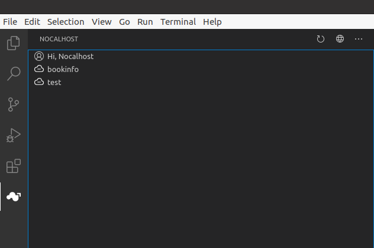

## 什么是 User

当你使用 `Nocalhost-Server`，以及 `Nocalhost-Plug-In` 时，`User` 用于标明你的身份，以及对资源访问的控制。这个 `User` 属于 `Nocalhost` 的独立概念，与 `kubernetes` 本身并无关联。

## User 是做什么的

`Nocalhost` 中存在两种  `User` 类型，一种是普通用户，普通用户只能在 IDE Plugin 进行登录，用户可以在自己的 `DevSpace` 下进行开发，这些 `DevSpace` 都由系统管理员进行创建。

另一种是系统管理员，例如初始的 `admin@admin.com`，系统管理员拥有访问 `Nocalhost-Web` 的权限，系统管理员拥有在 `Nocalhost-Web` 中的所有权限，如创建 `Application`、创建 `Cluster`、创建 `User` 和创建 `Space` 等。同样，系统管理员也拥有普通用户所有的权限，如可以在 `Nocalhost-Plug-In` 进行登录，获取自己的 `DevSpace` 列表，进行开发。

## User 的权限

普通的 `User` 只能看到属于自己的 `DevSpace`，并且拥有这些 `DevSpace` 下的所有权限，例如对 `DevSpace` 下相应 `Application` 的 `install`、`unInstall`（部署与销毁）、可以进入开发模式、进行端口转发等。

实际上，我们也会为这个 `User` 创建每个 `DevSpace` 对应的 `namespace` 的 `kubeconfig`，用于访问此 `namespace` 下的所有资源。

例如当前在 VSCode Plugin 登录的这个用户拥有 "bookinfo" 和 "test" 这两个 `DevSpace` 的权限。 

不过普通用户无法进入 `Nocalhost-Web`，也无法删除这个 `DevSpace` 本身，或者与这个 `DevSpace` 解除关系，这很像 k8s 某个 `namespace` 下的 `admin` 权限。