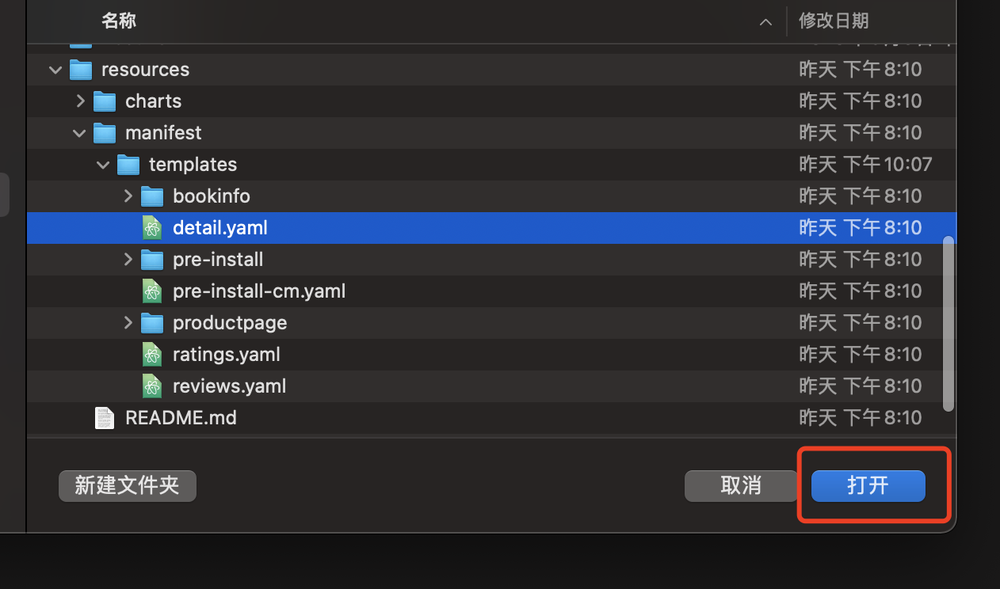

在 Nocalhost 插件，支持直接对 Kubernetes 资源直接进行修改，支持诸如 apply、edit、delete 等操作。

### 进行资源的修改

资源的修改支持任意的 Kubernetes 资源，**目前处于开发模式中的 Deployment 暂无法修改，后续的版本将开放修改。**

直接在左侧列表点击某个资源即可浏览，例如点击 Networks 修改 details 的 Services 定义：

{:target="_blank"}

将其类型由 ClusterIp 修改为 NodePort，并保存，即可完成对资源的修改：

{:target="_blank"}

{:target="_blank"}

### 进行资源的删除

与修改相同，任意的资源都可被删除，例如对一个 Pod 资源进行删除，在列表找到这个资源，点击右键，选择删除：

{:target="_blank"}

### 进行资源的应用

如果你想进行 Kubernetes 资源的应用，例如在本地进行了某些 Kubernetes 应用资源定义的修改，或者想要新增某些资源，对应 `kubectl apply -f`，可点击应用右键，选择具体的文件（文件夹的支持暂未上线），确定即可：

{:target="_blank"}

{:target="_blank"}

