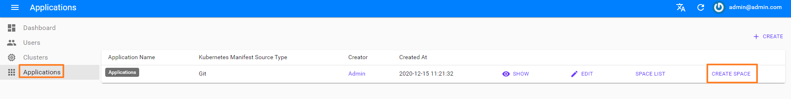
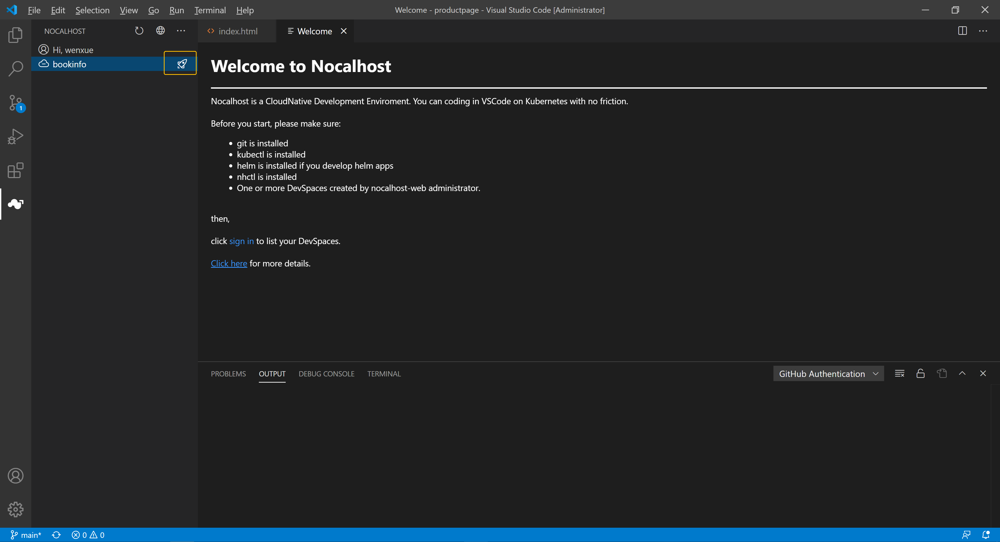
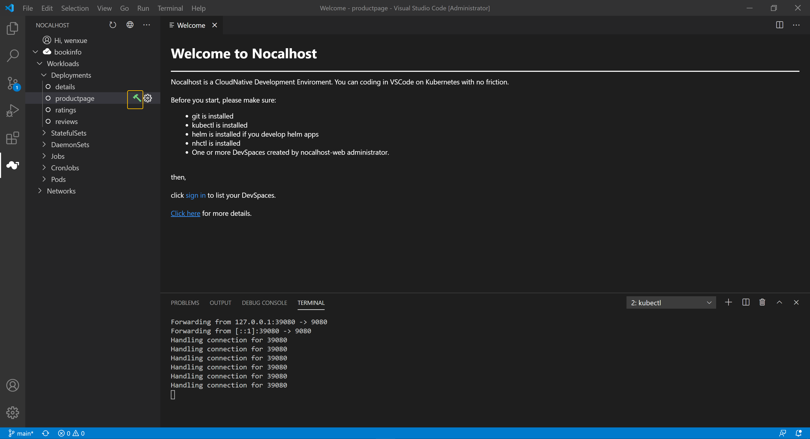

前置条件 ：
 - 一个 Kubernetes(1.16+) 集群(建议由云平台提供，Minikube 也可以) 
 - 配置好 kubectl 以管理员身份访问上述集群
 - 集群必须启用 RBAC
 - 安装好 Helm3
 - 安装好 Visual Studio Code(1.31+)
 - 安装好 Git
 - 安装 Nocalhost 客户端 (nhctl, IDE plugin) , [安装教程](https://nocalhost.dev/installation/)
 - 安装 Nocalhost 服务端 (nocalhost-api, nocalhost-web)  [参考快速上手的第二步](https://nocalhost.dev/zh/getting-started/)

## 1.应用配置

 - 1.1 是否需要定义微服务应用，服务启动的依赖，如果不需要则跳过这步骤，在步骤【5.开启 DevMode】配置要开发的服务信息即可。
 - 1.2 应用的 manifest 仓库根目录添加 .nocalhost/config 配置文件, 如图所示：


 - 1.3 配置文件（.nocalhost/config）对应用部署方式, 部署依赖, 源码的 git 仓库, DevContainer 的镜像,以及开发过程中的文件目录等做定义，如下是 bookinfo 应用的 manifest b部署方式的配置。

```
name: bookinfo # 应用的名称
manifestType: rawManifest # 应用部署方式
resourcePath: ["manifest/templates"] # 服务的 deployment YAML 相对于仓库的相对目录，支持配置多个目录 

onPreInstall: # 应用部署前，需提前部署的资源，权值越小，标识优先级越高
  - path: manifest/templates/pre-install/print-num-job-01.yaml
    weight: "1"
  - path: manifest/templates/pre-install/print-num-job-02.yaml
    weight: "-5"

services:
  - name: productpage # 服务名称
    serviceType: deployment # Kubernetes 部署资源的类型（deployment/statefulset/pod/job/cronjob/daemonset），默认 deployment
    gitUrl: https://github.com/nocalhost/bookinfo-productpage.git # 服务的 git 仓库
    devContainerImage: codingcorp-docker.pkg.coding.net/nocalhost/dev-images/python:3.7.7-slim-productpage # DevMode 使用的 docker image
    workDir: /home/nocalhost-dev # DevContainer 容器中存放本地同步代码的目录
    syncDirs: # 表示要同步本地的什么目录到 DevContainer 中，默认应用当前目录
    - ./
    devPorts: # DevContainer port-forwar 到本地的端口 如：9080:9080 表示 本地9080转发到9080, :9080 表示本地随机端口转发到集群9080
    - :9080
    dependJobsLabelSelector: # productpage 启动需要依赖 dep-job 启动完成，如果没有依赖关系，可以删除该项配置
    - "dep-job"
  - name: details
    serviceType: deployment
    gitUrl: https://github.com/nocalhost/bookinfo-details.git
    devContainerImage: codingcorp-docker.pkg.coding.net/nocalhost/dev-images/ruby:2.7.1-slim
    syncDirs:
    - ./
    workDir: /home/nocalhost-dev
  - name: ratings
    serviceType: deployment
    gitUrl: https://github.com/nocalhost/bookinfo-ratings.git
    devContainerImage: codingcorp-docker.pkg.coding.net/nocalhost/dev-images/node:12.18.1-slim
    workDir: /home/nocalhost-dev
    syncDirs:
    - ./
    dependJobsLabelSelector:
    - "dep-job"
    dependPodsLabelSelector:
    - "productpage"
    - "app.kubernetes.io/name=productpage"
  - name: reviews
    serviceType: deployment
    gitUrl: https://github.com/nocalhost/bookinfo-reviews.git
    devContainerImage: codingcorp-docker.pkg.coding.net/nocalhost/dev-images/java:latest
    workDir: /home/nocalhost-dev
    syncDirs:
    - ./
    dependPodsLabelSelector:
    - "productpage"
```
更详细的参数的使用说明，请 [点击](https://nocalhost.dev/References/nocalhost-config-yaml-spec/) 。


## 2. Nocalhost 服务端配置

Nocalhost服务端配置，可通过web页面进行配置（创建开发者账户，配置Kubernetes Clust，创建应用并关联 DevSpace）.
 - 2.1 创建用户, 用户名和密码在 IDE plugin 插件端做登录使用


 - 2.2 配置开发 Kubernetes Cluster, 建议配置 admin 角色的 kubeconfig 


 - 2.3 创建应用
 - 【Manifest Type】: 指定应用部署类型 manifest; 【Git Repo Url】: 配置应用 manifest Git 仓库（https/ssh）; 【Resource Dir】: manifest 相对于仓库的相对目录并支持配置多个目录, 默认是仓库根目录。


 - 2.4 创建应用的 DevSpace
 - 应用列表，点击 【create】, 选择应用要部署的 Kubernetest cluster, DevSpace 分配给哪个 user。 



**3. Nocalhost 客户端配置**
 - 配置 Nocalhost 服务端访问地址，然后登录, 并持久化在 ~/.nh/plugin/config.json
 - 服务端地址获取：Nocalhost server 部署时获取到的 server url（如：http://127.0.0.1:8080）。或者在 Nocalhost Server 部署的 Kubernetes 集群中查看 nocalhost-api 服务对外暴露的访问方式（如:loadBlance/NodePort等）。 
 - 登录账号获取：[2.1] 步骤创建的账号密码


## 4. 应用部署
 - 部署应用


 - 部署完成的效果


## 5. 开启 DevMode (开始开发)

 - 5.1 检查选择开发的服务参数是否正确，如果出现下图的情况，则表示这个服务还没进行参数配置，具体参数配置参考 步骤【1.应用配置】 

 
 - 5.2 选择要开发的服务，点击右边的绿色“锤子“的图标，然后选择“clone from Git repo” 或者 “open local directory” 加载源码, 项目的位置会持久化在 ~/.nh/plugin/config.json 中，再次进入 DevMode 开发，则会直接使用缓存的目录进行源码加载。


 - 5.3 开启 DevMode 成功，会自动把 DevContainer 端口转发到本地，在 IDE 弹出命令窗口。此时就可以享受开发，代码的任何变更，会实时同步到 DevContainer 容器。


 - 5.4 在容器中直接编译并运行，DevContainer 是一个拥有编译环境的镜像，编译完成直接运行即可。编译脚本和运行的脚本，需要用户自己准备，如 bookinfo productpage 提供的脚本：```sh run.sh```


 - 5.5 如果选择的是同步本地编译好的二进制文件到 DevContainer ， 在容器中直接运行即可，对 .nocalhost/config 配置文件的做如下修改。
 - ```
     services:
            ...
            syncDirs: # 同步目录配置为编译目录即可
            - ./
            ...
     ```

## 6. 关闭 DevMode (开发结束)
 - 点击 【5.1】 那个锤子的标识（开发中会变成红色带插的图标），结束 DevMode

## 7. 应用卸载
 - 在应用开发结束时，卸载应用，会 DevSpace 的资源进行释放回收。

