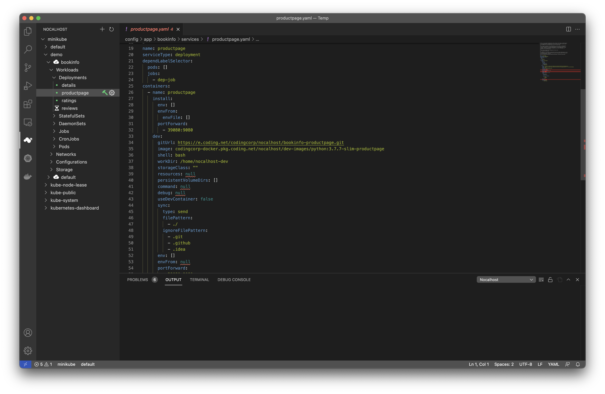

## Service 配置

### 1. 不进行任何 Service 配置

**Service** 并不是必须配置的，如果您没有进行任何 **Service** 相关的配置。但想在进入开发模式前对其进行配置，Nocalhost 编辑器插件会为您自动生成一个模板文件，您需对其进行修改并保存即可。

1. 选择一个需要开发的微服务，点击  对该服务进行配置

<center>
    
</center>

### 2. 添加 Service 配置

Nocalhost 对用户的 Kubernetes manifest 配置无侵入，如果你需要配置 **Service**。请在在你的仓库下新增 `.nocalhost/` 文件夹，并新增 [config.yaml](../../references/nh-config-spec) 文件。然后可以通过编辑器在本地进行修改，**这些修改只在本地生效**。

例如我们的示例应用 **bookinfo** 对 **productpage** 的 **Service** 进行了下述配置：

```yml
- name: productpage
  serviceType: deployment
  dependLabelSelector: 
    jobs:
      - "dep-job"
  containers:
    - name: productpage
      install: 
        portForward:   
          - 39080:9080
      dev:
        gitUrl: https://e.coding.net/codingcorp/nocalhost/bookinfo-productpage.git
        image: codingcorp-docker.pkg.coding.net/nocalhost/dev-images/python:3.7.7-slim-productpage
        shell: bash
        workDir: /home/nocalhost-dev
        sync: 
          type: send
          filePattern: 
            - ./
          ignoreFilePattern:
            - ".git"
            - ".github"
            - ".idea"
        portForward:
        - 39080:9080
```

当用户成功部署该应用后，Nocalhost 能自动读取到这些默认配置并自动应用在部署和开发模式上。

## Service 对开发模式的支持

我们用下述的 **productpage** 这个微服务的配置为例，来说明 **Service** 对 **开发模式** 进行支持的几个关键配置项：

```yml
- name: productpage
  serviceType: deployment
  dependLabelSelector: 
    jobs:
      - "dep-job"
  containers:
    - name: productpage
      install: 
        portForward:   
          - 39080:9080
      dev:
        gitUrl: https://e.coding.net/codingcorp/nocalhost/bookinfo-productpage.git
        image: codingcorp-docker.pkg.coding.net/nocalhost/dev-images/python:3.7.7-slim-productpage
        shell: bash
        workDir: /home/nocalhost-dev
        sync: 
          type: send
          filePattern: 
            - ./
          ignoreFilePattern:
            - ".git"
            - ".github"
            - ".idea"
        portForward:
        - 39080:9080
```

### name and serviceType

当你想使用 **Service** 时，`name` 与 `serviceType` 是 **必填项**，用于定位到某个 manifest，目前 Nocalhost 只支持 **Deployment** 一种 `serviceType`。

在上述例子中，**productpage** 的 `serviceType` 就是 **Deployment**:

```yml hl_lines="2"
- name: productpage
  serviceType: deployment
```

### gitUrl

用于标明与此微服务对应的源码地址，在进入**开发模式**时，你可以选择将本地某个目录同步到开发容器中，也可以选择从远端仓库拉取。

如果在在进入**开发模式**时已经配置了 `gitUrl`， Nocalhost 会自动帮你从这个 `gitUrl` 导出代码。例如：

```yml hl_lines="4"
containers:
...
    dev:
      gitUrl: https://e.coding.net/codingcorp/nocalhost/bookinfo-productpage.git
...
```

### image

进入开发模式所使用的容器镜像，可以使用自己的镜像，例如：

```yml hl_lines="5"
containers:
...
    dev:
      gitUrl: https://e.coding.net/codingcorp/nocalhost/bookinfo-productpage.git
      image: codingcorp-docker.pkg.coding.net/nocalhost/dev-images/python:3.7.7-slim-productpage
...
```

### workDir (Optional)

可选项，用于标明进入开发模式后的工作目录，以及同步文件所存放的目录，默认将使用 `/home/nocalhost-dev`。

```yml hl_lines="5"
containers:
...
    dev:
    ...
      workDir: /home/nocalhost-dev
    ...
...
```

### sync (Optional)

可选一组配置项，选择将源码目录的哪些文件夹同步到开发容器中，默认值为 `"."`。文件同步的类型可以是 `sent` 单向的，也可以是 `sendreceive` 双向的。 

```yml hl_lines="3"
containers:
...
      sync:
        type: send
        filePattern:
          - ./
        ignoreFilePattern:
          - .git
          - .github
          - .idea
...
```

### portForward

关于端口转发配置项有两处

#### 应用安装后自动转发的端口列表

在应用安装成功后，会自动将此 Pod 的远端端口转发到本地端口上，然后即可通过本地端口快速访问远端运行结果，该配置格式为`本地端口:远端端口`，例如：

```yml hl_lines="5"
...
  containers:
    - name: productpage
      install: 
        portForward:   
          - 39080:9080
```

#### 进入开发模式后自动转发的端口列表

在进入开发模式后，会自动将此 Pod 的远端端口转发到本地端口上，然后即可通过本地端口快速访问远端运行结果，该配置格式为`本地端口:远端端口`，例如：

```yml hl_lines="4"
containers:
...
      portForward:
        - 39080:9080
```

这里也可以支持不指定本地端口，例如 `:10000` 这种写法。Nocalhost 将随机把指定的远端端口转发到本地的某个端口上。

!!!tip "更多配置信息"
    请参考 [Nocalhost 配置](../../references/nh-config-spec) 查看 Nocalhost 更详细的配置信息。

## Service 指定启动顺序依赖关系

Nocalhost 控制支持基于依赖项的部署启动顺序。

!!!danger "Kubernetes 版本限制"
    此功能取决于 Kubernetes [admission webhooks](https://kubernetes.io/docs/reference/access-authn-authz/extensible-admission-controllers/)，因此请确保 Kubernetes 集群的最低版本要在 v1.16.0 或以上，并确保启用 **MutatingAdmissionWebhook** 和 **ValidatingAdmissionWebhook** 控制器。

### dependLabelSelector

服务所依赖的工作负载的标签选择器，这里有两个配置项：

#### pods

指明依赖的 Pods 标签选择器 (当前服务会等待被标签选择器选中的 Pod 处于 Ready 状态才启动)

例如 **productpage** 依赖于另一个名为 **foo** 的 Pod，那么可以对 **productpage** 进行如下配置:

```yml hl_lines="4"
- name: productpage
  serviceType: deployment
  dependLabelSelector: 
    pods:
      - "name=foo"
      - "app.kubernetes.io/name=foo"
```

#### jobs

指明依赖的 Jobs 标签选择器 (当前服务会等待被标签选择器选中的 Job 执行完毕才启动)

例如 **productpage** 依赖于另一个名为 **bar** 的 Job，那么可以对 **productpage** 进行如下配置:

```yml hl_lines="4"
- name: productpage
  serviceType: deployment
  dependLabelSelector: 
    jobs:
      - "job-name=bar"
      - "app.kubernetes.io/name=bar"
```