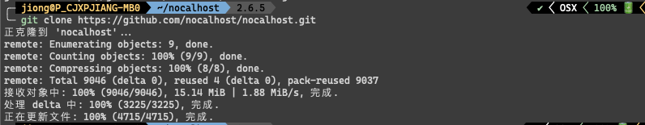
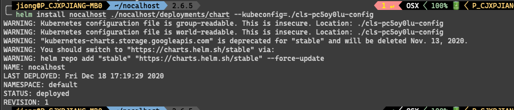
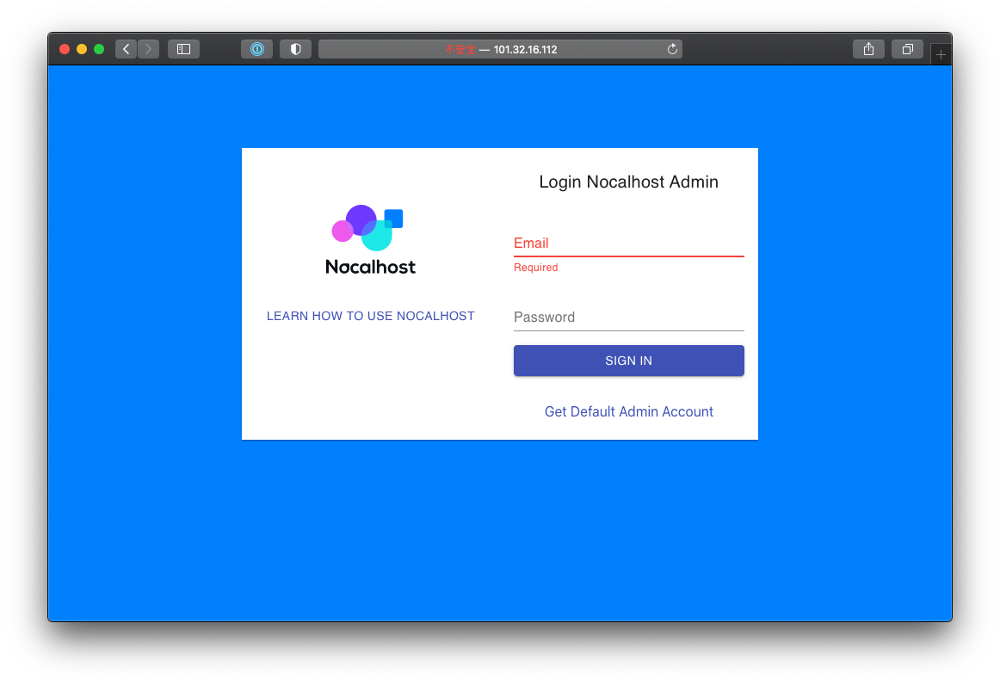
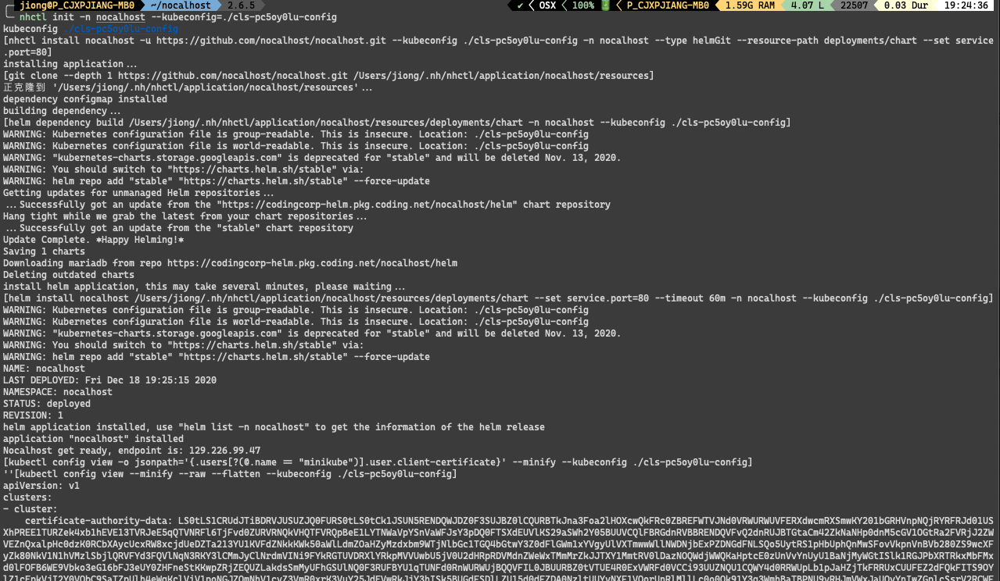
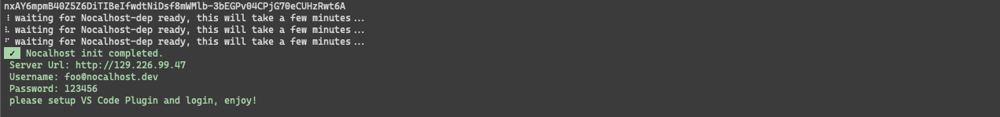

## 开始之前

前置条件:

- Kubernetes 1.16+ 集群
    * 建议使用公有云服务
    * 支持 Minikube
    * 已启用 RBAC
- 安装 kubectl 并已配置管理员身份访问上述集群
- 安装 Helm3
- 安装 Visual Studio Code(1.52+) 
- 安装 Git


!!! note "Kubernetes 集群要求"
	本文档主要描述与在云服务商提供的 Kubernetes 集群中使用。 <br />
	如果您使用的是 Minikube, 可以参照 [这里](/Tutorials/nocalhost-with-minikube/)

## 使用 Helm 部署 Nocalhost 服务

在使用 helm 方法部署 Nocalhost 服务时，您可以对部署的组件进行一些自定义更改。

helm chart 内容如下:

```yaml
# nocalhost 服务的默认变量。
# 这是YAML格式的文件。


replicaCount: 1

api:
  image:
    repository: codingcorp-docker.pkg.coding.net/nocalhost/public/nocalhost-api
    pullPolicy: Always
    # Overrides the image tag whose default is the chart appVersion.
    tag: latest

web:
  image:
    repository: codingcorp-docker.pkg.coding.net/nocalhost/public/nocalhost-web
    pullPolicy: Always
    # Overrides the image tag whose default is the chart appVersion.
    tag: latest

imagePullSecrets: []
nameOverride: ""
fullnameOverride: ""

podAnnotations: {}

podSecurityContext: {}
  # fsGroup: 2000

securityContext: {}
  # capabilities:
  #   drop:
  #   - ALL
  # readOnlyRootFilesystem: true
  # runAsNonRoot: true
  # runAsUser: 1000

#服务类型，如果您的 Kubernetes 集群没有 LoadBalancer 服务，则可以将其更改为 NodePort 服务
service:
  type: LoadBalancer
  port: 80

resources: {}
  # 资源默认值，通常不需要理会，如需指定或调整，可以取消注释以下内容，并且删除 “resource:” 后的花括号
  # limits:
  #   cpu: 100m
  #   memory: 128Mi
  # requests:
  #   cpu: 100m
  #   memory: 128Mi

autoscaling:
  enabled: false
  minReplicas: 1
  maxReplicas: 100
  targetCPUUtilizationPercentage: 80
  # targetMemoryUtilizationPercentage: 80

nodeSelector: {}

tolerations: []

affinity: {}

mariadb:
  fullnameOverride: nocalhost-mariadb
  commonAnnotations: {"helm.sh/hook":"pre-install","helm.sh/hook-weight":"1"}
  image:
    registry: codingcorp-docker.pkg.coding.net/nocalhost/public
    repository: mariadb
  auth:
    rootPassword: root
    database: nocalhost
  primary:
    persistence:
      size: "10Gi"
    extraVolumes:
    - name: nocalhost-api-sql-config-volume
      configMap:
        name: nocalhost-api-sql-init-config
        defaultMode: 0755
    extraVolumeMounts:
    - name: nocalhost-api-sql-config-volume
      mountPath: /docker-entrypoint-initdb.d/

#  initdbScripts:
#    my_init_script.sh: |
#      #!/bin/bash
#      echo "init database"
#      mysql -u root -p root nocalhost < /opt/init-sql/nocalhost.sql

```

### 第一步：克隆 nocalhost 的代码仓库到本地

```bash
git clone https://github.com/nocalhost/nocalhost.git
```

[  ](../assets/images/deployment-1.png){:target="_blank"}

### 第二步：使用 helm 命令进行安装

```bash
helm install nocalhost-server ./nocalhost/deployments/chart --kubeconfig=./cls-pc5oy0lu-config
```

等待初始化过程：
[  ](../assets/images/deployment-2.png){:target="_blank"}

获取 nocalhost-web 服务的公网地址。

[  ](../assets/images/deployment-3.png){:target="_blank"}

最后，您就可以在浏览器中访问 Nocalhost 了。

默认的邮箱地址为：
```
admin@admin.com
```

默认的密码为：
```
123456
```


## 使用 nhctl init 命令部署 Nocalhost 服务


### 第一步：安装 Nocalhost 命令行工具 nhctl

查看如何 [安装](/zh/installation){:target="_blank"} nhctl.

### 第二步：使用命令部署 Nocalhost 服务

```bash
nhctl init -n nocalhost --kubeconfig=./cls-pc5oy0lu-config
```

等待初始化过程：
[  ](../assets/images/deployment-4.png){:target="_blank"}

[  ](../assets/images/deployment-5.png){:target="_blank"}

获取 nocalhost-web 服务的公网地址。

[  ](../assets/images/deployment-3.png){:target="_blank"}

最后，您就可以在浏览器中访问 Nocalhost 了。

默认的邮箱地址为：
```
admin@admin.com
```

默认的密码为：
```
123456
```


