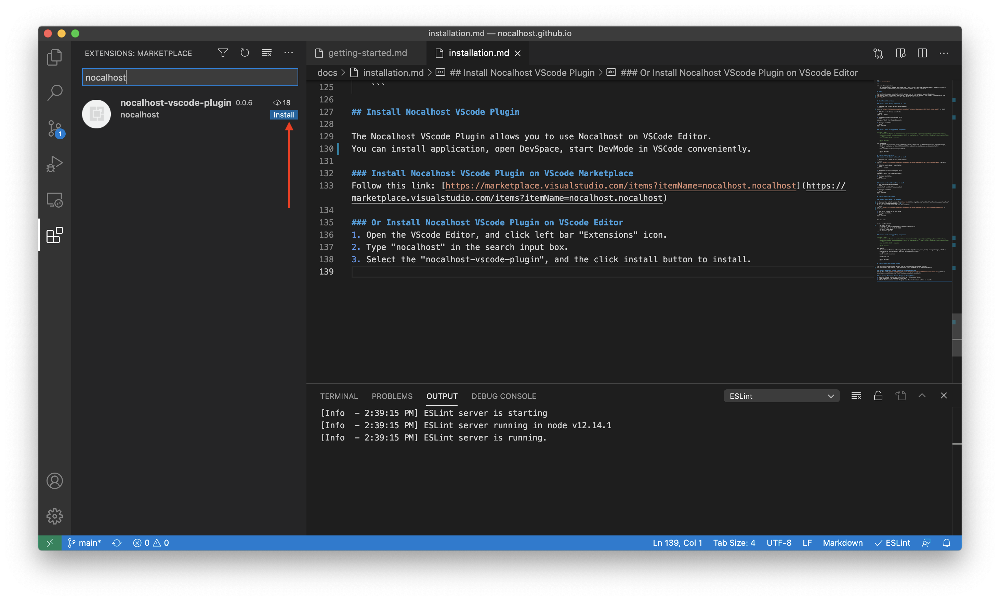

!!! note "前置条件"
	使用 nocalhost，请确保您已经安装了 [git](https://git-scm.com/downloads){:target="_blank"}、[kubectl](https://kubernetes.io/docs/home/){:target="_blank"} 以及 [helm](https://helm.sh/){:target="_blank"}。

## nhctl

Nocalhost 的命令行工具：nhctl。
您可以使用nhctl 进行安装应用程序，将服务切换到 DevMode，同步代码，转发端口等操作。 查看 [nhctl](/zh/References/cli-commands){:target="_blank"} 的指令集。


## 在 Linux 操作系统中安装 nhctl

### 使用 curl 工具安装 nhctl

1. 输入以下命令下载最新的 nhctl：
```bash
curl -sL https://git.io/JLsgQ | sh
```
2. 为 nhctl 添加可执行权限。
```bash
chmod +x ./nhctl
```
3. 将 nhctl 移动到您的环境变量中。
```bash
sudo mv ./nhctl /usr/local/bin/nhctl
```
4. 测试安装的结果。
```bash
nhctl version
```

### 使用包管理器安装 nhctl

=== "Homebrew"
	如果您在 Linux 上使用 [Homebrew](https://docs.brew.sh/Homebrew-on-Linux){:target="_blank"} 包管理器，则可以用其进行 [安装](https://docs.brew.sh/Homebrew-on-Linux#install){:target="_blank"}。
	```bash
	brew install nocalhost/repo/nocalhost

	nhctl version
	```

## 在 macOS 操作系统中安装 nhctl
### Install nhctl binary with curl on macOS

1. 输入以下命令下载最新的 nhctl：
```bash
curl -sL https://git.io/JLsgQ | sh
```
2. 为 nhctl 添加可执行权限。
```bash
chmod +x ./nhctl
```
3. 将 nhctl 移动到您的环境变量中。
```bash
sudo mv ./nhctl /usr/local/bin/nhctl
```
4. 测试安装的结果。
```bash
nhctl version
```

### 在 macOS 操作系统中使用 Homebrew 安装 nhctl
1. 输入以下命令：
```bash
brew install nocalhost/repo/nocalhost
```
2. 测试安装的结果。
```bash
nhctl version
```

## 在 Windows 操作系统中安装 nhctl

### 使用安装工具安装 nhctl
1. 点击 [此链接](https://github.com/nocalhost/nocalhost/releases/latest/download/NocalhostInstaller.exe)，下载安装工具。
2. 使用安装程序将会安装 nhctl，kubectl 和 helm。 并自动将安装目录添加到您的环境变量 PATH 中。
3. 打开您的 CMD 程序或者 PowerShell 程序, 测试安装的结果。
```bash
nhctl version
```

### 通过二进制文件安装

1. 通过 [此链接](https://github.com/nocalhost/nocalhost/releases/latest){:target="_blank"} 下载最新版本的 nhctl 二进制文件。<br />
或者，如果您已安装 curl，请使用以下命令：
```bash
curl -L "https://github.com/nocalhost/nocalhost/releases/latest/download/nhctl-windows-amd64.exe" -o nhctl.exe
```
2. 将此文件添加到您的环境变量 PATH.
3. 测试安装的结果。
```bash
nhctl version
```

您将看到：

```
nhctl: Nocalhost CLI
    Version: v0.0.5
    Git commit: 605cbf149a4b4d8983111b8984111365a5f54192
    Built: Sat Dec 12 13:29:03 2020
    OS/Arch: linux/amd64
    Go version: go1.14.4
```

## 安装 Nocalhost VScode 编辑器插件

Nocalhost 的 VScode 编辑器插可以让您在 VScode 编辑器上轻松方便的使用 Nocalhost。
您可以安装应用程序，打开 DevSpace，在 VSCode 中启动 DevMode。

### 在 VScode 插件市场上安装 Nocalhost VScode 插件
点击此链接: [https://marketplace.visualstudio.com/items?itemName=nocalhost.nocalhost](https://marketplace.visualstudio.com/items?itemName=nocalhost.nocalhost){:target="_blank"}

### 直接在 VScode 编辑器上安装 Nocalhost VScode 编辑器插件
1. 打开 VScode 编辑器, 在右侧栏中点击 "Extensions" 图标。
2. 在搜索框中输入 “nocalhost” 进行搜索。
3. 选择 “nocalhost-vscode-plugin”, 点击 “install” 按钮进行安装。


